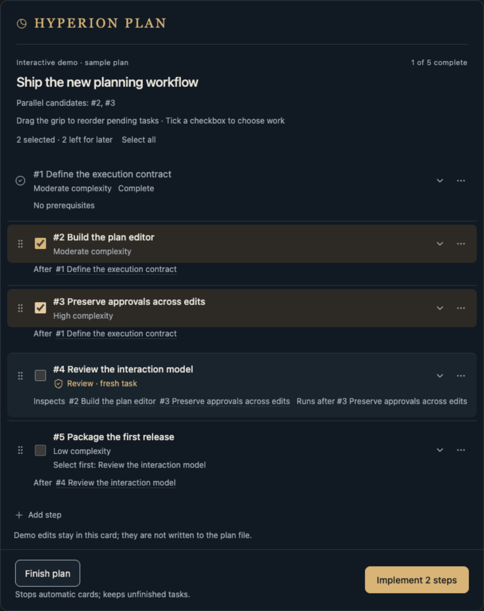

# Hyperion Plan

**A power user plan mode for serious developers.**

Hyperion Plan gives you control over how Codex tackles substantial engineering work. Turn a migration, refactor, or feature into an interactive plan with clear scope, dependencies, acceptance criteria, and review checkpoints. Refine the approach, select the work to implement, and keep the reasoning and results attached to the plan as the code changes.

## Install

Install directly from GitHub as a standalone skill by pasting this into a Codex conversation:

```text
$skill-installer install https://github.com/javiermolinar/Hyperion-plan/tree/v1.3.0/skills/hyperion-plan
```

Requires Node.js 22 or newer and the Visualize skill for interactive cards. After installation, invoke it with `$hyperion-plan`.

Upgrading from v1.0.0? Remove the old `plan-companion` skill after installing `hyperion-plan`, then ask Codex to refresh existing plan cards.

<picture>
  <source media="(prefers-color-scheme: dark)" srcset="assets/hyperion-plan-dark.png">
  <source media="(prefers-color-scheme: light)" srcset="assets/hyperion-plan-light.png">
  
</picture>

*Example plan with two steps selected. The card follows your light or dark appearance.*

## Take control of the work

- **Keep long plans manageable.** Group adjacent steps into collapsible milestones with progress and blockers. Select the steps you want to run.
- **Choose exactly what runs.** Select a step or a batch for implementation. Leave the rest for later. Saving a plan edit does not authorize more work.
- **Make hard work concrete.** Give each step a definition of done, prerequisites, and a reasoned complexity estimate. Ask Codex to split broad steps into work you can verify.
- **Shape the plan as you go.** Drag pending tasks into order, add constraints or questions to individual steps, and send edits back to Codex from the card. Dependencies and completed history stay protected.
- **Distinguish planning from code review.** **Review plan** offers a same-context refresh or an **Independent review** in a fresh task, with whole-plan or selected-step scope and optional focus. Review status and reconciled findings stay attached to the canonical plan without starting implementation. **Review implemented code** runs selected independent code reviews. Supporting evidence stays in step details.
- **Make review part of the plan.** Add independent review steps with explicit checks. Choose when a review runs and which work it inspects, then select it when you want it carried out.
- **Keep the plan honest.** Track progress, blockers, and completion evidence. Changes to approved requirements revoke the affected approval; changed prerequisites flag unfinished dependent work for another look.
- **Continue in fresh context.** Codex proposes handover checkpoints between coherent phases in large plans. Move or remove them like other pending steps; an approved run automatically continues in a fresh task when it reaches the checkpoint. Mid-step handover remains in the step menu. A fresh task receives the same canonical plan and working checkout; durable events record progress, next action, and execution ownership. Handover is manual, with no compaction prediction or context monitor.
- **Bring the context into code review.** Generate review briefs and PR notes from the plan's intent, acceptance criteria, discussions, and recorded results.

Finish a plan when you are done using it. **Finish plan** stops automatic cards and keeps the full history, including unfinished tasks. Ask Codex to reopen it whenever you want to continue.

## From plan to implementation

1. Ask Codex to build a plan for the change, including the dependencies and checks that matter.
2. Refine the steps in the card. Add notes, split uncertain work, and choose the next batch.
3. Click **Implement** to send that selection to Codex. Review its results in the refreshed plan before choosing what comes next.

The plan lives in Markdown alongside revision and approval bookkeeping. You and Codex can revisit it across turns, and agents can inspect or update it through the bundled CLI. Interactive cards run inside the Codex conversation through Visualize; the CLI requires Node.js 22 or newer.

Codex chooses reasoning effort for new steps and shows it as a compact badge. Click its brain-icon badge to optionally choose a different level; existing plans without a preference keep the task setting. Explicit levels are passed to supported Codex execution interfaces when available; saving the plan does not change an already running turn.
