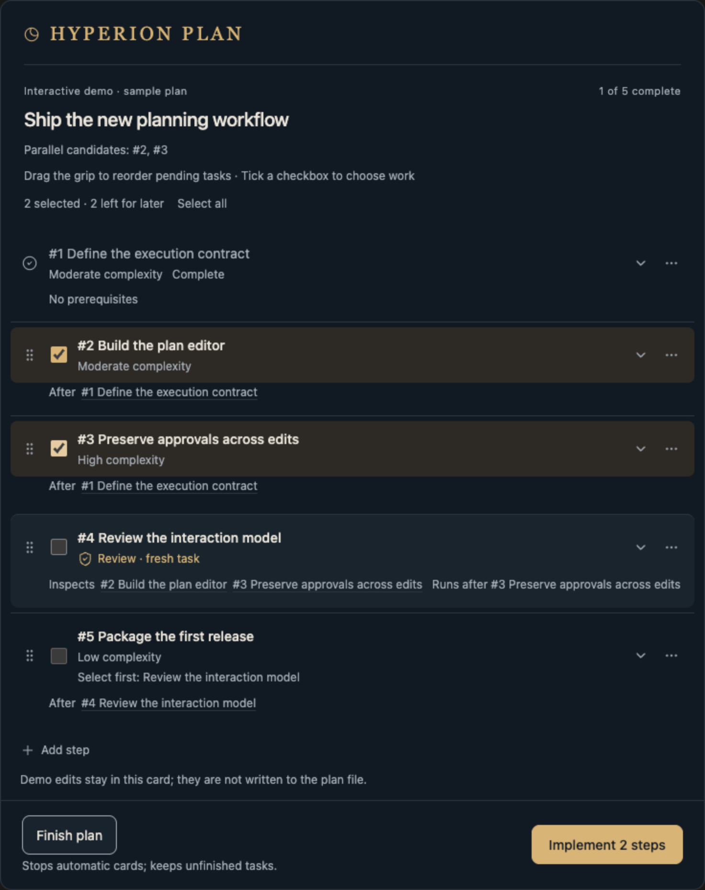

# Hyperion Plan

**A power user plan mode for serious developers.**

Hyperion Plan gives you control over how Codex tackles substantial engineering work. Turn a migration, refactor, or feature into an interactive plan with clear scope, dependencies, acceptance criteria, and review checkpoints. Refine the approach, select the work to implement, and keep the reasoning and results attached to the plan as the code changes.

## Install

Install directly from GitHub as a standalone skill by pasting this into a Codex conversation:

```text
$skill-installer install https://github.com/javiermolinar/Hyperion-plan/tree/v1.4.1/skills/hyperion-plan
```

Requires Node.js 22 or newer and the Visualize skill for interactive cards. After installation, invoke it with `$hyperion-plan`.

Upgrading from v1.0.0? Remove the old `plan-companion` skill after installing `hyperion-plan`, then ask Codex to refresh existing plan cards.

<picture>
  <source media="(prefers-color-scheme: dark)" srcset="assets/hyperion-plan-dark.png">
  <source media="(prefers-color-scheme: light)" srcset="assets/hyperion-plan-light.png">
  
</picture>

*Example plan with Ask Codex, two steps in a parallel group, reasoning efforts, and a handover checkpoint. The card follows your light or dark appearance.*

## What’s new in v1.4.1

Changed steps stay selectable with a **Changed since last review** warning. Run validates the selection against the latest plan; unchanged selections from older cards can proceed, and already completed work is skipped. Actual blockers and missing prerequisites still prevent execution, with a reason and a concrete next action shown beside the disabled control.

Architecture revisions can save scope, dependencies, and review evidence together. If an in-progress step changes scope, **Needs replanning** and **Resume with updated scope** make the interruption explicit while preserving earlier work. Refresh existing cards after upgrading to see these controls.

## Take control of the work

- **Keep long plans manageable.** Group adjacent steps into collapsible milestones with progress and blockers. Select the steps you want to run.
- **Choose exactly what runs.** Select a step or a batch for implementation. Leave the rest for later. Saving a plan edit does not authorize more work.
- **Model-managed effort and parallel work.** During planning, Codex assigns effort and identifies independent steps. The card shows effort badges and numbered parallel groups without a subagent toggle. On Run, Codex decides what to delegate, then integrates and verifies results. Reviews and context handovers keep their place in the flow.
- **Make hard work concrete.** Give each step a definition of done, prerequisites, and a reasoned complexity estimate. Ask Codex to split broad steps into work you can verify.
- **Shape the plan as you go.** Drag pending tasks into order, or use **Ask Codex** on a step to request a change, split work, add a review, or ask a question. Dependencies and completed history stay protected.
- **Distinguish planning from code review.** **Review plan** offers a same-context refresh or an **Independent review** in a fresh task, with whole-plan or selected-step scope and optional focus. Review status and reconciled findings stay attached to the canonical plan without starting implementation. **Review implemented code** runs selected independent code reviews. Supporting evidence stays in step details.
- **Make review part of the plan.** Add independent review steps with explicit checks. Choose when a review runs and which work it inspects, then select it when you want it carried out.
- **Keep the plan honest.** Track progress, blockers, and completion evidence. Changes to approved requirements revoke the affected approval; changed prerequisites show an advisory warning on unfinished dependent work. Recheck assumptions during Run without a separate review gate.
- **Continue in fresh context.** Codex proposes handover checkpoints between coherent phases in large plans. Move or remove them like other pending steps; an approved run automatically continues in a fresh task when it reaches the checkpoint. Ask Codex to plan an additional context handover. A fresh task receives the same canonical plan and working checkout; durable events record progress, next action, and execution ownership. There is no compaction prediction or context monitor.
- **Bring the context into code review.** Generate review briefs and PR notes from the plan's intent, acceptance criteria, discussions, and recorded results.

Finish a plan when you are done using it. **Finish plan** stops automatic cards and keeps the full history, including unfinished tasks. Ask Codex to reopen it whenever you want to continue.

## From plan to implementation

1. Ask Codex to build a plan for the change, including the dependencies and checks that matter.
2. Refine the steps in the card. Add notes, split uncertain work, and choose the next batch.
3. Click **Implement** to send that selection to Codex. It checks the latest plan, resolves routine inconsistencies, and asks only when a meaningful decision is missing. Review its results in the refreshed plan before choosing what comes next.

The plan lives in Markdown alongside revision and approval bookkeeping. You and Codex can revisit it across turns, and agents can inspect or update it through the bundled CLI. Interactive cards run inside the Codex conversation through Visualize; the CLI requires Node.js 22 or newer.

Codex chooses reasoning effort for new steps and shows it as a compact badge. Click its brain-icon badge to optionally choose a different level; existing plans without a preference keep the task setting. Explicit levels are passed to supported Codex execution interfaces when available; saving the plan does not change an already running turn.

## Use the native Pi screen

The Pi adapter opens the same Markdown plan and uses the shared Hyperion core; it does not create a parallel plan format. Build and install the package from a checkout:

```bash
npm --prefix skills/hyperion-plan install
npm --prefix skills/hyperion-plan run build
pi install --local "$PWD/skills/hyperion-plan"
```

Before upgrading or reloading, settle and reconcile any old managed work with the old version/owning host. Replacing files does not stop old writers. Preserve legacy ledgers, reports and configuration; unresolved activity holds new execution. After that, run `/reload` yourself or start a fresh Pi session. Rebuilding the bundle does not update an already-loaded session. You can then ask naturally:

- “Open `docs/pi-support-plan.md`.”
- “Show the current plan.”
- “Rename step 2 to ‘Verify recovery’.”
- “Add a note to step 3 about the missing smoke test.”
- “Finish this plan” or “Reopen this plan.”

The model-callable `hyperion_plan` tool supports `discover`, `open`, `show`, `create`, `edit`, `finish`, `reopen`, `submit`, `checkpoint`, and `plan-review`. The last three accept explicit shared requests or coordinator-observed outcomes; stored approval and returned agent reports are not authority or completion evidence. Opening resolves the plan and queues the native screen until the current turn settles. Edits save directly through the shared core with plan identity, revision, ownership, and retry checks; they do not discard unsent screen drafts or authorize implementation. Creating requires a new `.md` path and title in the tool call and creates no tasks. For a new planning request without a preferred filename, the agent uses `plans/<short-topic>.md`. Requested dummy/demo plans can use `demo: true` so discovery ignores them. Inspection and mutations also work in non-TUI modes; opening there returns plan data and reports that the screen is unavailable.

`/hyperion [path/to/plan.md]` is the single terminal entry point for the plan and its agents. Without arguments, `/hyperion` reopens the session binding, uses the project default, or discovers one unambiguous active plan. Ambiguous or incomplete discovery offers a plan picker; if no active candidates are found or scanning is disabled, it asks for a path. Broken bindings and invalid defaults report an error rather than silently switching plans. A missing explicitly selected `.md` path can create a new empty plan after confirmation through the command. The extension never searches outside the workspace or resumes saved approval automatically.

### Plan awareness and two views

Before each user turn, the extension supplies the model with planning guidance and a compact canonical snapshot. “Plan this change” uses Hyperion without naming it; “show the plan” requests the overlay, while status questions stay inline. Session bindings are read from the active branch, including after restoration or compaction.

Resolution prefers the session binding, then an explicit project default, then one unambiguous active canonical plan. Configure a workspace default in `.pi/hyperion-plan.json`:

```json
{"default_plan":"docs/pi-support-plan.md"}
```

Or disable automatic scanning with `{"discover":false}`. Discovery is bounded, read-only, and parser-validated. It excludes fixture/test/example/build/hidden directories, symlinks, generated exports, and plans marked `<!-- hyperion-plan-demo -->`. Plain Markdown is not silently converted. Ambiguous or incomplete discovery requires a choice; broken bindings and invalid defaults never silently switch to another plan. Finished plans are history, not resumable approval.

A compact **plan status strip** above the prompt shows the plan name, current or next step, a progress bar with completed/total steps, running agents, and blockers with their reasons. Colored segments and thin chevrons match a Powerline-style footer: one row in wide terminals, two at standard widths, with field-boundary wrapping in narrow terminals. Plan tool results use an unboxed one-line receipt; expand them to inspect full details or errors. Canonical saves update it at tool/turn boundaries without adding conversation messages, stealing focus, or starting another turn. Pi's native footer and other extensions remain intact. The progress bar counts completed steps equally; it does not estimate time or effort remaining. In-progress steps do not count as completed. The bar shrinks in narrow terminals. No elapsed-time or ETA placeholders are shown, and tracking needs no timers or clock entries. Restored unsettled agents appear as **unknown**, never as running. Finished plans clear the footer unless agents still need attention. The **overlay** remains the interactive workspace. Select work with **Space** and press **Enter** to run it. Describe plan changes in chat. The agent handles routine refresh, stale drafts, resolved blockers and recovery. Busy requests queue for the next turn; no repeated Run or Save-first sequence is required. Refresh preserves selected reviews.

Pi exposes `hyperion_plan` and optional `hyperion_agent`, a single foreground SDK assignment with explicit context and exact read/write paths. Prefer available host delegation or current-session sequential fallback; there is no wave scheduler. Native `hyperion_agent run` validates files inside the coordinator workspace and records the start checkpoint before launch; pre-launch rejections are visible in Agents with an actionable reason and no invented native session. The coordinator still owns verification and separate completion checkpoints. Set `HYPERION_DISABLE_AGENTS=1` before loading to disable the fallback. See [delegation and limits](skills/hyperion-plan/references/pi-runner.md). Selection is local; **Run** is the one explicit user execution request. Ready requests save exact scope through the shared core; requests needing reconciliation reach the coordinator with their selected requirements and draft context instead of being disabled. The coordinator admits execution only after resolving real constraints, without another approval. Add/Edit/Note and Ask are agent-mediated plan-only requests, not implementation authority. Legacy drafts remain recoverable; unrelated unsent drafts are not silently applied by Ask. Ownership, unknown writers, actual prerequisites and evidence-gated completion remain enforced internally. The dedicated Pi review/setup runtime has been removed. Explicitly selected reviews use available host/external reviewers with fresh context. The coordinator inspects reports and records reviewer identity, reviewed revision, findings and limitations through shared operations; Hyperion neither provisions tests nor certifies artifacts. Missing independent checks remain incomplete, and findings do not authorize fixes. Preserve old evidence/configuration and settle unresolved managed work with the old version/owning host before upgrading or reloading. See [review outcome recording](skills/hyperion-plan/references/review-checks.md). There is no automatic refill or resumption. Handoff is host-owned and must satisfy shared readiness and ownership transfer; unsupported checkpoints remain incomplete. Hyperion does not create or navigate destinations. Unknown settlement stays blocked. See [handoff limits and legacy records](skills/hyperion-plan/references/pi-handover.md). Non-TUI modes can use the plan tool or shared CLI, not the native screen. Pi 0.87.1 or newer is the supported native UI baseline; Pi 0.87.1 itself requires Node.js 22.19 or newer.

Inside `/hyperion`, press **A** to inspect the coordinator's Hyperion delegates, including while an assignment is running. The read-only Agents view lists assignments on the left and the selected agent's live tool activity and response text on the right. **B** returns to the same plan with selection and drafts preserved. **Tab** switches panes, **↑/↓** navigates, **Page Up/Down** scrolls logs, **End** follows new output, and **Esc** closes Hyperion without stopping work. Narrow terminals show one pane at a time. Restored unfinished assignments are labelled unknown, not running; finalized logs come from their native transcripts. The viewer does not monitor delegates launched by other host tools, start background execution, or mark plan steps complete.

### Real Pi regression checks

```bash
npm --prefix skills/hyperion-plan run test:pi:runtime
npm --prefix skills/hyperion-plan run test:pi:terminal
npm --prefix skills/hyperion-plan run test:pi:agents
# Requires existing Playwright/Chromium paths; see development.md:
npm --prefix skills/hyperion-plan run test:pi:workflow
```

The runtime test uses the real Pi SDK and a deterministic, network-free provider to inspect model-visible tools and plan context across startup, reload, newly loaded tools, and session restoration. The terminal test runs the real interactive CLI under VHS, exercises reload and a prompted open without a plan path, and captures the overlay, plan footer, and bound reopen. It requires `vhs` and `ttyd`. VHS uses an installed or cached Chromium browser and may download its browser runtime when neither is available. Temporary workspaces, settings, and credentials are isolated; test artifacts are retained in the printed temporary directory. These tests do not establish real-model language-routing accuracy or explain every live-session extension failure.

The plan menu has four actions: **Space** selects, **Enter** runs the selection, **Esc** closes, and **A** opens Agents. **↑/↓** navigates steps. Details appear beside the list on wide terminals and below it on narrow terminals; no view-toggle key is needed. In Agents, **B** returns to the plan. Editing, adding notes, questions, reordering, and finish/reopen requests belong in chat. Fullscreen mouse clicks select steps and activate the same four controls.
