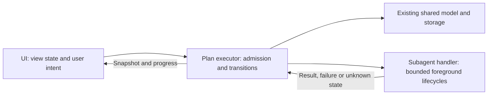

# Host contracts and compatibility boundary

`src/hosts/contracts.ts` defines the shared transport/read-model boundary. It does not implement worker dispatch. The existing `ChangeRequest`, core transitions and storage remain authoritative. No canonical Markdown, sidecar, receipt hash, native task ID or published card requires migration.

## Pi simplification target

**Architecture decision for `plans/pi-architecture-simplification.md`.** The refactor implements the executor/subagent/UI boundaries in five Pi source files. The final source/test/fixture inventory is 13 files, with the three-file deviation explained below. Installed-session dogfooding and independent review remain distinct from fixture validation. The disposition table preserves the original module inventory.

Hyperion should organize work and record coordinator-observed outcomes, not implement a second coding-agent harness. The target is three responsibilities, five Pi production files and about five test/fixture files. File count is a budget, not a reason to concatenate modules or move Pi-specific machinery into the shared core.

### Responsibility and dependency direction

- **Executor:** translates explicit user intent into existing shared requests/checkpoints. Owns plan identity/revision/owner checks, readiness, current selected scope, pause/cancel rules, and coordinator-recorded outcomes. Prepares the assignment and rechecks scope before accepting its result. It does not run a background loop or automatically advance to the next step. The coordinator model still chooses work, inspects files/tests, and requests outcome transitions. Native dispatch validates workspace files and records the start checkpoint in the same tool operation, before launch; invalid preflight leaves progress unchanged and returns a structured rejection visible in Agents.
- **Subagent handler:** runs a supplied assignment with explicit context, tool permissions, model/effort, cancellation signal and an admission callback. Returns identity, transcript/report reference, outcome and limitations. It receives no canonical `Plan`, imports no plan service or transitions, and never checkpoints or interprets review acceptance. Implementation and review differ in prompt/permissions, not lifecycle implementations.
- **UI:** renders snapshots, progress and draft/selection state, and emits intent. Pure shared draft validation is allowed; authorization, persistence and dispatch are not. Readiness explanations come from the executor. Request delivery is not acceptance or completion.
- **Extension wiring and context helpers:** connect Pi events/tools to these components, resolve the canonical plan, and restore bindings/drafts. They are supporting adapters, not extra policy owners. The shared CLI/service must not import `src/pi/*`; Pi depends on the shared core, never the reverse.

The refactor removes service/CLI imports of Pi completion gates and routes screen/tool admission through the executor. `extension.ts` now registers components; context owns binding/discovery/observation, UI owns rendering/local drafts, and the executor owns native request admission/transport. Review provisioning/certification, managed waves and transfer/automatic-recovery protocols were deleted rather than relocated into shared code. The later minimal fork/join adds two-child foreground admission and read-only Pi-session result inspection, not a replacement scheduler or recovery engine.

### Host capability evidence and tool decision

Inspection baseline: commit `f6bc8a0`, repository-pinned Pi SDK **0.87.1**. This was source/API inspection, not a new worker launch or live-provider test.

| Observed capability | Evidence | Consequence |
| --- | --- | --- |
| No built-in generic subagent tool in the pinned SDK | `dist/core/tools/index.d.ts` lists `read`, `bash`, `powershell`, `edit`, `write`, `grep`, `find`, `ls` | Do not assume stock Pi supplies delegated work/result handling |
| Public session construction and settlement primitives exist | SDK `createAgentSession`, `SessionManager`, session `prompt`, `abort`, `waitForIdle`, `agent_settled`; existing runner fixtures exercise them | A small foreground SDK fallback is possible without private loader APIs |
| Extension context exposes the selected model and registry, not its owning `AgentSession` | Pinned `dist/core/extensions/types.d.ts`; baseline `src/pi/model-proxy.ts` (now in `subagents.ts`) uses `ModelRegistry.streamSimple` | Reuse the public selected-model proxy when needed; never forward its dummy child API key as the parent's credentials |
| Native session replacement is command-only | Pinned `ExtensionCommandContext.newSession`/`switchSession`, absent from ordinary tool context | A model tool must not pretend it can synchronously transfer the live coordinator |
| This conversation has external session-opening tools, but no external managed assignment/result tool | Available tool descriptions: independent interactive sessions, not managed subagents; their results do not return to this chat | These can serve explicitly authorized fresh external reviews or handoffs, but are not managed workers and do not automatically return review results |
| Installed documentation describes `ctx.executeTool`, but pinned 0.87.1 declarations do not | Compare current Pi extension docs with the pinned `ExtensionContext` | No dependency upgrade or tool-to-tool bridge is assumed by this design |

**Decision:** keep `hyperion_plan` required. A second, optional `hyperion_agent` is justified on the inspected baseline if managed delegation is enabled. Prefer a user-configured, compatible host delegation facility when present; otherwise the small SDK handler supplies it. Do not discover and invoke tools by guessed names, build a provider registry, or install another extension automatically. A host-owned facility can be called directly by the coordinator; Hyperion does not need an adapter for every agent package. Disabling Hyperion delegation leaves only the plan tool, with current-session sequential implementation and explicitly reported external-review limitations.

| Tool | Target responsibility | Not included |
| --- | --- | --- |
| `hyperion_plan` | Existing discovery/open/show/create/edit/finish/reopen, plus canonical request submission, per-step checkpoints and review outcome recording through shared operations | Worker launch, test execution, automatic approval from stored state, automatic next-step execution |
| `hyperion_agent` (optional) | Run one explicitly scoped assignment per call (at most two live children in one authorized request cohort); inspect assignment/group evidence; foreground cancellation follows Pi abort/shutdown/switch lifecycle | Review-specific APIs, test setup, waves, detached workers, scheduler, automatic retry/resume, session handover |

Plan-operation schemas must distinguish an edit from execution-request submission, a progress checkpoint and an independent-review outcome; one tool name must not erase those authorization distinctions. Keep stable request IDs and observed revisions. When no caller ID is supplied, derive a stable valid request ID from the Pi tool-call identity; preserve it for retries rather than assuming the raw ID satisfies the shared identifier format or generating a new ID on each attempt. Do not add boolean approval fields that pretend to prove user consent: the coordinator supplies current conversational authority, while code enforces canonical scope, actor, revisions and lifecycle constraints. Existing advanced shared CLI operations remain available; no second persistence implementation is introduced.

Remove `hyperion_review`, `hyperion_review_setup`, `hyperion_wave` and `hyperion_handover` from registration and operational prompts. Do not retain aliases that quietly reproduce their old workflows. The `/hyperion` command is the single human UI entry point, not another model execution tool. A opens Agents and B returns to the plan.

### Small assignment contract and explicit limits

The executor prepares an opaque assignment ID, working directory, instructions, explicit context/read inputs, permitted write files, requested effort and a live gate/cancellation signal. Plan/request/step correlation stays with the executor; the handler need not parse it. Read-only review uses the same handler with no write permissions. Returned prose is evidence to inspect, not a verdict enforced by storage.

The SDK fallback is **foreground and bounded to two live children**, one assignment per call in the same authorized `request_id` cohort. Exact canonical claims permit read/read overlap and reject write conflicts, duplicate active step ownership and foreign live cohorts. Start reservations/checkpoints serialize under the existing plan lock; known sibling revisions do not waive changed scope, request or owner checks. Requested sequential execution and reviews are exclusive; selected review/handover barriers and dependencies still apply. There is no pool, queue, background continuation, automatic refill or cross-plan claim scheduler. This is not the retired managed-wave protocol.

Require an already-persisted original coordinator session. Persist parent launch intent, native identity and exact claims before asynchronous child construction; the SDK can defer the child file until its first assistant entry. Observe SDK/tool/abort settlement, then persist the child terminal marker before the parent terminal result. Pi sessions remain the sole execution-history/report store, with no `run.json`, new transcript store or plan-schema change. Repeated live IDs join; recorded IDs inspect, never relaunch. Scope revocation stops admission through the executor gate. Cancellation aborts and joins all known children; abort acknowledgement alone is not quiescence. Unresolved writers hold integration, completion, reuse and transfer. These are cooperative in-process guarantees, not OS sandboxing or global coordination with other sessions.

Read-only assignment/group inspection validates the current original coordinator and plan/request scope. Matching bounded version-3 native JSONL can recover a missing parent report only from a correlated child settlement marker. It returns labeled child evidence with unchanged parent lifecycle; unknown-writer fences remain. Missing/corrupt evidence or final assistant prose alone is unknown. No reconciliation, interrupted-script replay, child resurrection, cross-coordinator adoption or automatic continuation API is supplied. Session files are history, not live handles; sleep, network interruption and process death do not guarantee continuation. See [Pi delegation](pi-runner.md) for inspection limits.

The fallback exposes only the existing bounded filesystem read/edit/write capability needed for the assignment, with explicit read scope, exact permitted writes and protected plan/session artifacts excluded. Do not copy parent history, ambient extensions or nested delegation. Tests and broader shell work stay with the coordinator or an explicitly chosen external host. This deliberately avoids rebuilding child-process accounting or test provisioning in `subagents.ts`. A reviewer who could not independently run a required check reports that limitation; the coordinator cannot relabel its own prior test run as reviewer evidence. Per-step effort is applied only at a supported SDK boundary; unsupported current-session overrides are disclosed, not simulated.

### Final maintained file inventory

Paths below are relative to `skills/hyperion-plan/`. Baseline inspection found **33 Pi source files and 24 Pi tests/fixtures (57 total)**, containing 4,643 and 5,126 lines respectively. This narrower inventory is distinct from the earlier 76-file branch addition count, which also includes shared code/tests, references and generated bundles.

| Target file | Responsibility |
| --- | --- |
| `src/pi/extension.ts` | Tool/command/event registration and thin wiring; no execution policy |
| `src/pi/executor.ts` | Plan tool operations, UI intent admission, readiness and explicit checkpoints over shared core; legacy execution preflight |
| `src/pi/subagents.ts` | Optional generic foreground SDK lifecycle, restricted tools, selected-model proxy and effort handling |
| `src/pi/ui.ts` | Terminal screen, local drafts/selection, formatting and tool/progress renderers |
| `src/pi/context.ts` | Bounded discovery, binding/branch restoration and data-only model context |
| `tests/pi-executor.test.cjs` | Admission, revisions, ownership, cancellation-before-write and review outcome compatibility |
| `tests/pi-subagents.test.cjs` | Actual offline SDK lifecycle, scoped tools/context, effort, cancellation and ambiguous attempts |
| `tests/pi-context.test.cjs` | Context/discovery, package loading, actual SDK reload/restoration and compaction |
| `tests/pi-intent.test.cjs` | Natural-language intent, deferred delivery and real-lock admission races |
| `tests/pi-ui.test.cjs` | Drafts, selection, keyboard/mouse, resize, rendering and progress without focus changes |
| `tests/pi/fixture.ts` | Shared deterministic provider, SDK and marker-guarded workflow setup; never loaded by production |
| `tests/pi/terminal-smoke.cjs` | Actual CLI/VHS startup, reload, queued open and screenshot capture |
| `tests/pi/terminal-workflow.cjs` | Actual CLI/ttyd/browser keyboard, mouse, IME, resize and selected-work scenarios |

**13 maintained Pi-specific files**, down from 57. The three-file deviation from ten retains a focused intent/race suite and the two terminal drivers: combining their different process/input/capture mechanisms would not remove complexity. All pre-consolidation test registrations and assertions survive. Source is 1,998 lines (previously 4,643); tests/fixtures remain roughly 2,800 lines (previously 5,126). Test regrouping itself is not a code-size reduction; the earlier deleted runtime responsibilities account for the reduction. Five production modules range from 24 to 748 lines, and five test suites remain under 800 lines each. No Pi-only logic moved into shared modules.

Existing shared-core/Codex suites remain. Build configuration, package metadata, documentation, generated bundles and canonical plan/evidence data are outside this count; every Pi-only helper and terminal driver is included.

### Keep / delete / replace map

All existing `src/pi/` files are assigned below. These are responsibility moves, not a concatenation recipe.

| Existing modules | Disposition |
| --- | --- |
| `extension.ts` | Keep as thin entry point; move plan operations/admission to executor, view/controller behavior to UI, binding to context |
| `tools.ts`, `execution.ts` | Replace with executor entry points over shared operations; move renderers to UI |
| `ui.ts` | Keep presentation/drafts; remove independent policy decisions and consume executor readiness results |
| `awareness.ts`, `discovery.ts` | Consolidate canonical resolution and prompt context in `context.ts` |
| `progress.ts` | Put formatting in UI, branch-aware observed state in context, and event subscription in extension wiring |
| `runner.ts`, `recovery.ts`, `effort.ts`, `model-proxy.ts` | Replace with the small generic handler; retain relevant SDK lifecycle/permission/effort logic, not plan-coupled dispatch or recovery frameworks |
| `dispatch-ledger.ts` | Delete the managed dispatch/wave ledger writer and verifier; preserve existing files as history and inspect legacy holds in executor preflight |
| `review.ts`, `review-tool.ts`, `review-checkpoint.ts`, `review-contract.ts`, `review-evidence.ts`, `review-snapshot.ts`, `review-tests.ts`, `native-review-tests.ts`, `review-process.ts`, `review-config.ts`, `review-resources.ts`, `review-setup.ts` | Delete specialized review execution, certification, test processes and resource setup; shared review data and coordinator outcome recording remain |
| `wave.ts`, `wave-runtime.ts`, `wave-tool.ts`, `wave-checkpoint.ts` | Delete managed selection/reservation/verification/reconciliation stack; any external parallelism is coordinator/host-owned |
| `handover-code.ts`, `handover-journal.ts`, `handover-navigation.ts`, `handover-readiness.ts`, `handover-tool.ts` | Delete automatic capture/readiness/transfer/navigation runtime; retain the small restored-session owner fence through executor checks/event wiring, not a new handover module |

Outside `src/pi/`, keep real shared plan functionality in `model.ts`, `transitions.ts`, `agent.ts`, `storage.ts`, `markdown.ts`, `json.ts`, `handovers.ts`, `exports.ts`, `service.ts`, `cli.ts` and the Codex/browser adapter. Remove service/CLI imports of Pi completion gates. Keep host-neutral request/checkpoint/ownership wording and pure admission in `instructions.ts`, `execution-instructions.ts`, `execution-policy.ts`; remove obsolete worker-certification-only helpers when unused, not useful core checks. Prune unused execution-adapter/wave-oriented contracts from `hosts/contracts.ts` rather than implementing the speculative generic adapter lifecycle. Keep snapshot/submission types and unchanged native IDs. No Pi SDK, process supervisor, runtime evidence verifier or module dependency moves into these shared files.

Replace the current Pi test families as follows:

- Plan tools, cancellation and external outcomes -> executor suite; native intent and race admission -> intent suite.
- Discovery/awareness and actual SDK package/tool/restoration cases -> context suite.
- Screen/interactions -> UI suite; progress observation -> executor suite. Both terminal drivers reuse the single offline provider fixture; their distinct capture/input mechanisms stay separate.
- Generic runner lifecycle, effort, model-proxy, restricted-tool and cancellation cases -> subagent suite.
- Review provisioning/resource/setup/snapshot certification, wave-ledger and handover-runtime tests -> delete with those capabilities. Retain focused legacy-state/owner tests in executor/intent and existing shared review/handover model tests. Do not present fewer tests as equivalent coverage of intentionally removed features.

Target distribution keeps the shared CLI/library/browser bundles and the Pi extension bundle. Stop building/shipping the opt-in `pi-runner.js` and `pi-handover-*` bundles when their APIs are removed; the optional handler is part of the extension, not another public runtime package. Rebuild artifacts from source rather than editing generated JavaScript.

### Compatibility and migration boundary

| Area | Retain | Change or explicit limitation |
| --- | --- | --- |
| Canonical plans | IDs, revisions, Markdown/JSON, sidecars, receipts, redirects, progress, notes, review/handover history | No bulk migration, regenerated plan, reset statuses or recovered authorization |
| Codex and shared CLI | Existing edit/request/checkpoint/review/handover model operations and owner checks | Pi-only completion certification hooks are removed; the CLI is not an SDK runtime supervisor |
| Review outcomes | Checks, report/reviewer references, reviewed revision and finding reconciliation | Coordinator attestation replaces snapshot/artifact/test-suite certification; older reports are preserved, not retroactively revalidated or treated as covering new code |
| Handover metadata | Shared prepare/readiness/transfer rules, native owner IDs and old session ownership fences | No Pi automatic destination creation/navigation/resume; a host-owned handoff must satisfy the shared protocol, or remain unsupported/incomplete |
| Pi binding/drafts/context | Existing branch entries, unsent drafts and no automatic restoration-triggered execution | Retired dispatch/setup instructions are historical data, not operations to replay |
| Managed runtime APIs | Historical result/transcript/configuration files stay on disk | Review/wave/handover tools and standalone runtime exports are intentionally removed, without compatibility launch shims |
| Delegation guarantees | Current authority, scoped tools/context, cancellation and honest result/unknown state | No global write-claim arbitration, review certification, test sandbox, process-tree supervision or durable recovery engine |

**Upgrade precondition:** settle/cancel old managed work and reconcile it using the old version before replacing/reloading the extension. There is no hot migration of live agents. Package replacement does not prove that old writers stopped. Document this in the release/installation guidance; never reload the user's live session merely to validate this design.

The executor's bounded read-only preflight checks the selected plan's existing `.hyperion-dispatch/<plan-filename>/ledger.json`, associated handover runtime records and canonical owner/review/handover state. It must distinguish terminal history from active/uncertain records, unreconciled waves and unfinished handovers. Missing lifecycle/settlement fields, malformed records or an unreadable known runtime record cannot be treated as an empty history. This check reads recorded lifecycle state, not snapshot hashes or test artifacts; it does not certify that the old evidence is true. Report the specific retained artifact and required reconciliation; do not rewrite its phase, adopt its destination, infer settlement from a missing process, or launch replacement work. This is a compatibility hold, not a port of the old recovery/verifier. Read-only plan inspection remains available.

Completed/reconciled legacy records need no new certification. For outstanding legacy holds, use the old version/owning host to establish the actual result and stop writers; if that is unavailable, document the unresolved limitation rather than fabricating completion or deleting history. New runtime work must not reuse an unresolved old assignment. Existing transferred source sessions keep their owner fence, including across branch changes; no native ID is forged to bypass `execution_owner`.

The shared core remains host-neutral: direct CLI/filesystem writers are not protected by a Pi lifecycle monitor. Cross-session coordination and truth of externally supplied evidence remain the coordinator's responsibility. Preserving these limits explicitly is preferable to retaining a large certification system under a generic name.

### Acceptance and follow-through

Later selected steps must verify the dependency direction, exact registered tools, unchanged canonical/Codex behavior, legacy holds/owner fences, explicit checkpoint semantics, and actual SDK cancellation/identity. Fixtures establish transport/lifecycle behavior, not real-model correctness. Dogfood this same plan without silently reloading, finishing or transferring it. Independent review, when selected, prefers an explicitly authorized fresh external reviewer through available host delegation facilities, with the read-only `hyperion_agent` fallback when unavailable and no reviewer has launched. Both paths record their limitations; neither depends on the removed review executor. Unknown launch or settlement never permits switching paths or replacement work.

The original architecture checkpoint was documentation-only. Subsequent production checkpoints record implemented boundaries and focused regression evidence. The final inventory records the file-budget deviation rather than claiming ten files. Fixture checks do not establish installed-session dogfooding or independent review; their actual results and limitations belong in separate plan checkpoints.

## Ownership of responsibilities

| Responsibility | Owner |
| --- | --- |
| Render DOM or terminal controls; focus, selection and drafts | Host frontend |
| Persist/restore host drafts; deliver follow-ups; build native session links | UI adapter |
| Validate request intent, revision, scope, prerequisites and receipts | Shared core |
| Lock, refresh and persist canonical state; check actual actor identity | Shared storage/service |
| Decide whether approved work is independent, integrate it, verify and checkpoint | Coordinator |
| Execute one bounded assignment and return correlated evidence | Execution adapter, when implemented |

`PlanSnapshot` includes canonical identity/revision, source digest, refresh status and summary. It is a read model, not a grant of execution authority. `PlanMutationResult` additionally describes whether a save changed state. `service.ts` re-exports these types for existing consumers.

`PlanUiAdapter<Draft>` owns host transport, not rendering or request construction. Draft encoding is deliberately host-specific: Codex retains its `modelContent`/`privateContent` widget state and Pi retains its session entries. Stable IDs, base revisions, retry IDs and unsent changes must survive delivery failures. A snapshot refresh must reconcile conflicts rather than silently overwrite drafts.

`SubmissionOutcome` distinguishes delivery from canonical acceptance/rejection. The browser receives only delivery confirmation; the coordinator must apply the request. Pi may apply under the shared lock before delivering an implementation turn. Even a saved request whose follow-up failed does not start work. Neither accepted nor delivered means started or completed. Only later observed checkpoints establish progress.

## Action inventory

| Existing action | Contract | Authorization |
| --- | --- | --- |
| Open/show/discover, details, navigation | Read canonical snapshot or host view | None |
| Explicit empty-plan creation | Shared `createPlan` service | Creation only |
| Selection, expansion, questions being typed, draft notes | Host draft persistence | None |
| Pending-row reorder | Draft `reorder_steps`, included in next request | No canonical save until request application |
| Save edits / add / remove / change effort or groups | `ChangeRequest` with `intent: edit` and operations | Edits only |
| Ask about a step | `intent: ask`, one target and isolated question | Answer or explicitly requested plan edits; no implementation |
| Refresh plan assumptions | `intent: review` | Plan freshness only |
| Split step / replan dependencies | `intent: decompose` / `replan` | Plan edits only; new work remains unselected |
| Independent plan review | `intent: review`, `review_mode: independent` | One fresh review and reconciliation, not implementation |
| Run implementation or code-review steps | `intent: implement`, selected stable IDs | Only accepted scope, subject to current user request and mode |
| Continue in fresh context | `intent: handover` plus existing transfer lifecycle | Readiness then ownership transfer; no scope expansion |
| Finish / reopen | `intent: finish` / `reopen` | Lifecycle only; reopen never restores approval |

The browser remains a published snapshot. It does not poll the filesystem. Pi can reload canonical state at settlement; this does not grant approval or erase conflicting edits.

## Capabilities and identities

A capability is `native`, `agent-mediated`, or `unsupported` with a reason. It describes availability, not permission. Agent-mediated capability requires checking the actual tools in the execution session; a browser cannot promise worker capacity or verified cancellation. Unsupported features must be reported, not simulated. Pi supplies an optional foreground SDK assignment per call, bounded to two live children in one authorized request cohort, with exact canonical filesystem claims and read-only session-based evidence inspection. Implementation and read-only review share that lifecycle; no managed waves, artifact certification or coordinator transfer/navigation remain. Host-owned delegation/handoff and sequential fallback retain their explicit limitations.

`HostSession` pairs a host name with an unchanged native ID. The actor passed to shared mutations is the actual session/task ID, not a newly prefixed ID or another owner's identity. Native navigation URLs are generated only by the matching host adapter. Existing Codex owner strings and saved handovers retain their meaning. UI navigation never transfers ownership.

## Future assignments and evidence

`WorkAssignment` records plan/request/step identity, scope digest, actual owner, role, checkout, owned paths, acceptance criteria, evidence location and requested effort. It is bookkeeping, not approval. `AssignmentRecord` separates prepared intent, ambiguous launching, a persisted running handle and a settled correlated result. An uncertain launch must be reconciled, never blindly duplicated.

`AssignmentResult` records actual session identity, outcome, changed paths, evidence, requested/actual effort and quiescence. The coordinator checks correlation and current scope, integrates changes and verifies acceptance before any completion checkpoint. A worker's successful result is not canonical completion. An aborted call, timeout, process exit or first rejected promise alone cannot establish that all writers stopped; `Quiescence` explicitly permits an unknown state that blocks transfer and workspace reuse.

A handover destination is not a worker that returns a result: it becomes the coordinator through the existing prepare/readiness/transfer/continuation protocol. Its lifecycle must survive source cleanup. These retained host-neutral types do not provide a launcher, ledger writer, pool, recovery or task creation. The old Pi runtime implementations have been removed. The optional generic handler returns native identity/report/limitations; its executor records correlation in native session entries rather than a new dispatch ledger.

## Supported baseline and verification

The Pi adapter is compiled against Pi/TUI **0.87.1**, whose Node baseline is **22.19+**. This is the tested baseline, not a claim that older releases cannot work. Mouse/fullscreen behavior belongs to the Pi screen and TUI integration, never to the shared core; keyboard operation remains available without fullscreen mouse support. Execution uses public SDK APIs and is verified against that pinned version rather than copied upstream private loader APIs. Isolated Pi 1.0.3 tests additionally exercise actual QuickJS Codemode nested calls and overlapping SDK children; they do not upgrade the pinned dependency or reload a user's live session. Offline interruption/restoration fixtures do not establish real macOS sleep, network-loss or process-death reliability.

Codex browser bundles and the shared CLI do not import Pi SDK/TUI modules. Host contracts have no DOM, `window.openai`, process-control or terminal-multiplexer dependency. Test capability failures, canonical compatibility and simulated adapter delivery separately from real host operation. A simulated browser callback is not evidence of a real Codex send dialog or conversation submission.
